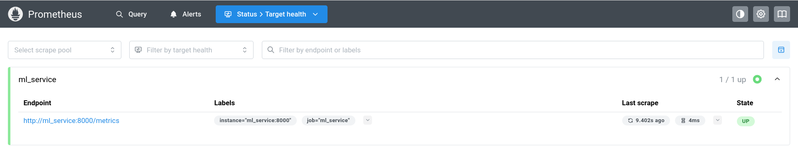
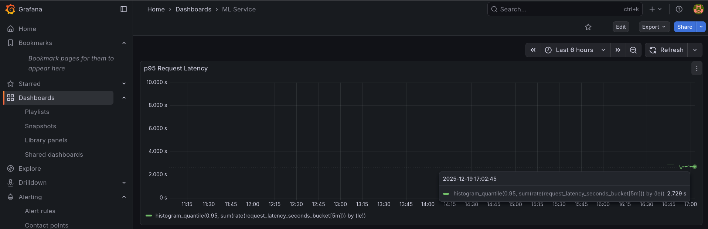
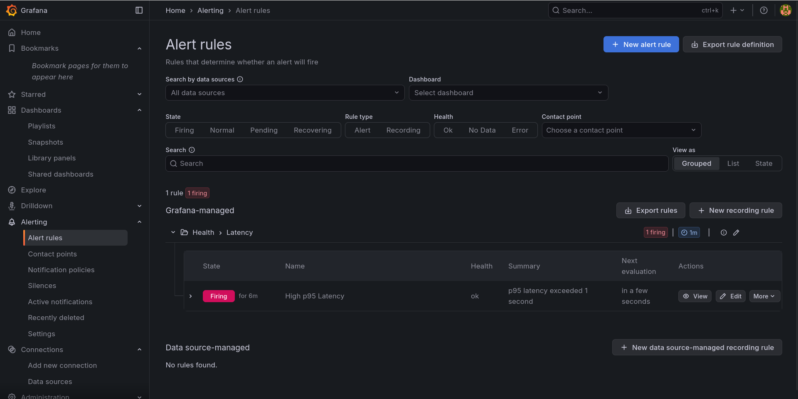
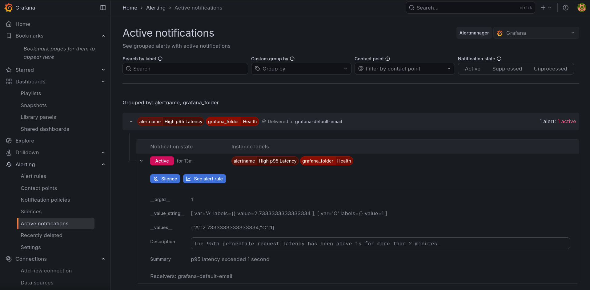

# Система мониторинга и алертинга для ML-сервиса с использованием **Prometheus** и **Grafana**

## Определение SLO

Выбран следующий **Service Level Objective (SLO)**:

> **95-й перцентиль задержки обработки запроса (p95 latency) должен быть меньше 1 секунды.**

Это означает, что 95% всех запросов к ML-сервису должны обрабатываться быстрее, чем за 1 секунду.

---

## ML-сервис

Сервис реализован на **FastAPI** и эмулирует работу ML-модели с переменной задержкой.  
Метрика задержки экспортируется через **Prometheus Histogram**.

- Эндпоинт предсказания: `GET /predict`
- Эндпоинт метрик: `GET /metrics`

Пример ответа:
```json
{"prediction": "OK", "latency_sec": 1.83}
```

---

## Структура проекта

```
.
├── Dockerfile                  # Сборка ML-сервиса
├── alert-rules.yaml            # Настройки алерта
├── docker-compose.yml          # Запуск всех сервисов
├── grafana-dashboard.json      # Дашборд Grafana
├── main.py                     # Исходный код ML-сервиса
├── prometheus.yml              # Конфигурация Prometheus
└── requirements.txt             # Зависимости Python
```

---

## Настройка и запуск

1. Клонируйте репозиторий:
   ```bash
   git clone https://github.com/mipt-bio3/mlops_hw4
   cd mlops_hw4
   ```

2. Запустите сервисы:
   ```bash
   docker-compose up -d
   ```

3. Дождитесь старта. Проверьте:
   - ML-сервис: [http://localhost:8000/predict](http://localhost:8000/predict)
   - Метрики: [http://localhost:8000/metrics](http://localhost:8000/metrics)
   - Prometheus: [http://localhost:9090/targets](http://localhost:9090/targets) → статус `UP`
   - Grafana: [http://localhost:3000](http://localhost:3000) (логин/пароль: `admin`/`admin`)

---

## Настройка Grafana

### 1. Источник данных
- Добавлен источник **Prometheus** по адресу: `http://prometheus:9090`

### 2. Дашборд
- Создана панель **Time series** с запросом:
  ```promql
  histogram_quantile(0.95, sum(rate(request_latency_seconds_bucket[5m])) by (le))
  ```
- Единицы измерения: **seconds (s)**
- Название панели: **p95 Request Latency**

### 3. Алерт
- **Правило**: `High p95 Latency`
- **Условие**: `p95 latency > 1 секунда`
- **Требование**: условие должно выполняться непрерывно в течение `2 минут`
- **Запрос:**
```promql
histogram_quantile(0.95, sum(rate(request_latency_seconds_bucket[5m])) by (le))
```
---

## Проверка срабатывания алерта

1. Генерация нагрузки:
   ```bash
   while true; do curl -s http://localhost:8000/predict; sleep 1; done
   ```
   Сервис случайно генерирует задержки (см. `main.py`), что приводит к нарушению SLO.

2. Через ~2–3 минуты алерт переходит в статус **Firing**.

---

## Скриншоты








